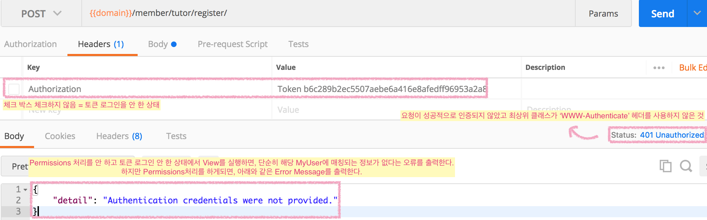

# Permissions
- [Authentication]()과 Permissions는 접근을 수락할 것인지 거부할 것인지를 결정한다.
- Permissions는 보통 다른 인스턴스 정보를 가진 사용자가 나의 인스턴스만 접근할 수 있는 페이지에 접근하려할 때 사용된다.
- Permissions는 항상 다른 코드가 실행되기 전, **View가 시작될 때 체크** 하며, `요청에 대한 허용 여부를 판단`하기 위해  `request.user`와 `request.auth`의 인증 정보를 사용한다.


## 사용 권한 형태
- 가장 간단한 사용 권한 형태는 인증된 모든 사용자에게 액세스를 허용하고, 인증되지 않은 모든 사용자에 대한 액세스를 거부하는 것이다. 이것은 DRF의 `IsAuthenticated` 클래스에 해당한다.
- 강도가 더 낮은 사용 권한으로 DRF의 `IsAutenticatedOrReadOnly`가 있는데, 해당 사용 권한은 인증된 사용자일 경우 모든 권한(생성/조회/수정/삭제)를 허용하고, 인증되지 않은 사용자는 조회만 허용하도록 하는 것이다.

## 사용 권한 검사 실패
권한 검사가 실패하면, `exceptions.PermissionDenied` 또는 `exceptions.NotAuthenticated` 예외가 발생하고 **View가 실행되지 않는다.**

### 권한 검사 실패 Status
- **HTTP 403 Forbidden** : 요청이 성공적으로 인증되었으나 사용 권한이 거부된 것 또는 요청이 성공적으로 인증되지 않았고 최상위 Authentication 클래스가 WWW-Authenticate 헤더를 사용하지 않은 것.
- **HTTP 401 Unauthorized response** : 요청이 성공적으로 인증되지 않았고 최상위 클래스가 WWW-Authenticate 헤더를 사용하지 않은 것 

## Object Level Permissions
Permissions는 object-level permissioning을 제공한다.

- 사용자가 모델 인스턴스에 대한 접근 및 조작 허용 여부를 결정할 때 사용된다.
- `.get_object ()`가 호출 될 때, DRF의 View에 의해 실행되며, View의 사용 권한과 같이 유저가 지정된 객체를 조작 할 수 없는 경우에 exceptions.PermissionDenied 예외가 발생한다.
- 하지만 성능상의 이유로 제네릭 뷰는 object-level permissions를 자동으로 적용하지 않는다. 그렇기 때문에 object-level permissions를 사용하려면 쿼리셋을 적절하게 필터링해야 한다.

```python
def get_object(self):
    obj = get_object_or_404(self.get_queryset())
    
    # View에서 get_object()를 override하여 내용을 변경할 때,
    self.check_object_permissions(self.request, obj) # 를 명시적으로 호출해야 한다.
    
    return obj
```

## Permissions 적용하기
**1. 우선 `settings`에 Permissions를 사용할 것이라는 내용을 선언해야 한다.**

```python
REST_FRAMEWORK = {
    'DEFAULT_PERMISSION_CLASSES': (
        'rest_framework.permissions.IsAuthenticated',
    )
}
```

**2-1. CBV인 APIView에서 다음과 같이 사용 권한을 반영할 수 있다.**

```python
class ExampleView(APIView):
    permission_classes = (IsAuthenticated,)

    def get(self, request, format=None):
        content = {
            'status': 'request was permitted'
        }
        return Response(content)
```

**2-2. FBV인 경우, `@api_view` 데코레이터를 활용하여 다음과 같이 사용 권한을 반영할 수 있다.**

```python
@api_view(['GET'])
@permission_classes((IsAuthenticated, ))
def example_view(request, format=None):
    content = {
        'status': 'request was permitted'
    }
    return Response(content)
```

인증되지 않은 유저가 뷰를 실행시킬 때,



## API Reference
### AllowAny
- 요청이 인증되었거나 인증되지 않았는지 여부와 관계가 없다.
- 의도를 명시화 시키는 목적으로 주로 쓰인다.

### IsAuthenticated
- 인증되지 않은 사용자의 사용 권한을 거부한다.
- 등록된 사용자만 API에 액세스할 수 있도록 할 때 적합하다.

### IsAdminUser
- user.is_staff가 True 인 경우를 제외하고 모든 사용자에 대한 권한을 거부한다.
- 관리자만 접근할 수 있는 페이지에 대한 API 액세스에 적합하다.

### IsAuthenticatedOrReadOnly
- 인증된 사용자일 경우 모든 권한(생성/조회/수정/삭제)를 허용하고, 인증되지 않은 사용자는 조회만 허용한다.

[...]

### Custom permissions
커스텀 사용 권한을 적용하기 위해서, BasePermission과 아래의 메서드를 오버라이드해야 한다.

- .has_permissions(self, request, view)
- .has_object_permissions(self, request, view, obj)

위 메서드는 액세스가 허용되면 True를 그렇지 않으면 False를 반환한다.

```python
class BlacklistPermission(permissions.BasePermission):
    """
    Global permission check for blacklisted IPs.
    """

    def has_permission(self, request, view):
        ip_addr = request.META['REMOTE_ADDR']
        blacklisted = Blacklist.objects.filter(ip_addr=ip_addr).exists()
        return not blacklisted
```

요청이 읽기 모드인지 쓰기모드인지 테스트하고자 한다면, 'GET', 'OPTIONS'와 'HEAD'와 같은 튜플 형태의 `SAVE_METHODS`와 비교하여 요청 메서드를 점검해야 한다.

```python
if request.method in permissions.SAFE_METHODS:
    # Check permissions for read-only request
else:
    # Check permissions for write request
```

## 참고자료
- [Django rest framework 공식문서 - Permissions]()