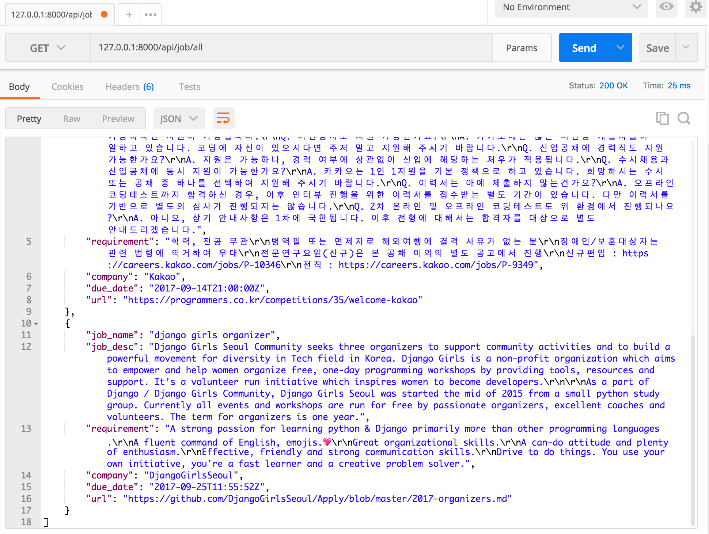

# Filtering

django의 기본 queryset을 사용하면 특정 모델의 모든 objects를 반환하게 됩니다.
그런데 당연히 그 중 `특정한 objects`만 pick하고 싶은 경우가 생기겠죠?

그럴 때 가장 쉬운 방법이 django의 `get_queryset()`을 override하는 방법입니다.

다음 3가지 방법을 살펴보겠습니다.
* URL로 필터링하기
* query 인자로 필터링하기
* user로 필터링하기

## URL로 필터링하기

url의 마지막 부분을 가지고 query를 하는 방법입니다.
예를 들어 저의 예제에서는
```python
# urls.py
from position.views import job_api,job_url_api

urlpatterns = [
    url(r'^admin/', admin.site.urls),

    # REST API
    url(r'^api/job/all', job_api.as_view()),

    # REST API URL
    url(r'^api/job/(?P<company>.+)$',job_url_api.as_view()),
]

```
라고 설정해놓았습니다.
여기에서 `(?P<company>.+)` 라는 정규식 부분은 / 이후에 나오는 모든 문자열을 company라는 값으로 할당해서 넘겨주겠다는 뜻입니다.

그리고 job_url_api에서는
```python
# api View
class job_url_api(GenericAPIView, mixins.ListModelMixin):
    queryset = Job.objects.all()
    serializer_class = JobSerializer

    def get(self,request,*args,**kwargs):
        return self.list(request,*args,**kwargs)

    def get_queryset(self):
        company_name = self.kwargs['company']
        return Job.objects.filter(company__contains=company_name)
```

그러나 url로 filtering을 한다고 하면, 다중 필터링일 때 문제가 생깁니다.
company와 job_name으로 다중 필터링을 한다고하면 url이
```
/(?P<company>.+)/(?P<job_name>.+)/
```
의 식으로 계속 길어지게 됩니다.
또한 위의 url은 job_name과 company를 동시에 필터링하는 url 이면서 순서를 지켜서 넣어줘야한다는 단점이 있겠네요.
즉 job_name으로만, 혹은 company로만 필터링 하기는 어려워지는 거겠죠?

## query 인자로 필터링하기

이번에는 query parameter를 가지고 필터링을 해보겠습니다.
기본적으로 주어진 api 주소에 parameter를 넘겨서 필터링을 하는 방법입니다.

api 사용자가 `<api주소>/?<인자이름>=<내용>`
으로 넘기면, 인자이름과 넘어온 내용을 가지고 queryset을 적절하게 걸러주면 됩니다.

job_api에서는
```python
class job_api(GenericAPIView, mixins.ListModelMixin):
    serializer_class = JobSerializer

    def get(self, request, *args, **kwargs):
        return self.list(request, *args, **kwargs)

    def get_queryset(self):
        queryset = Job.objects.all()
        company_name = self.request.query_params.get('company', None)
        if company_name is not None:
            queryset = queryset.filter(company__contains=company_name)
        return queryset

```
으로 설정해줍니다.
request에서 넘어온 query_params 중, company에 해당하는 걸 받고, 없는 경우 None으로 받습니다.
if로 분기처리를 통해 None이 아닌 경우 filter를 적용합니다.

postman으로 확인해봅니다.



## user로 필터링하기

## Generic Filtering
## Setting filter backends
## Filtering and object lookups
## Overriding the initial queryset
## API Guide
## DjangoFilterBackend
## SearchFilter
## OrderingFilter
## DjangoObjectPermissionsFilter
## Custom generic filtering
## Example
## Customizing the interface
## Pagination & schemas
## Third party packages
## Django REST framework filters package
## Django REST framework full word search filter
## Django URL Filter
## drf-url-filters
