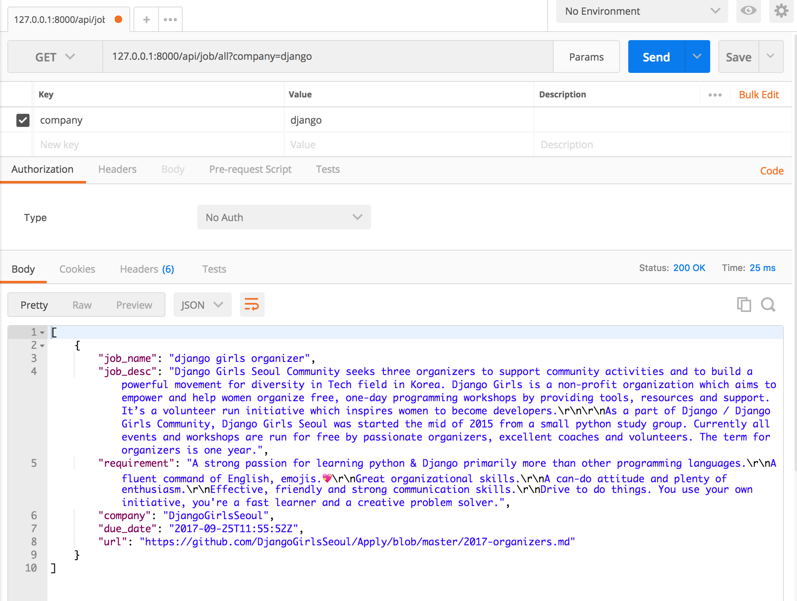
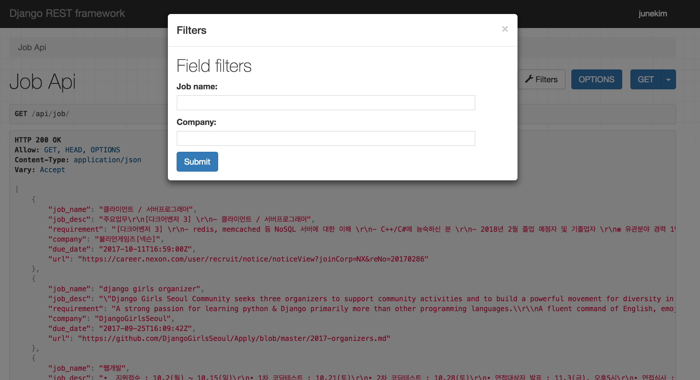

# Filtering

django의 기본 queryset을 사용하면 특정 모델의 모든 objects를 반환하게 됩니다.
그런데 당연히 그 중 `특정한 objects`만 pick하고 싶은 경우가 생기겠죠?

그럴 때 가장 쉬운 방법이 django의 `get_queryset()`을 override하는 방법입니다.

다음 3가지 방법을 살펴보겠습니다.
* URL로 필터링하기
* query 인자로 필터링하기
* user로 필터링하기

### URL로 필터링하기

url의 마지막 부분을 가지고 query를 하는 방법입니다.
예를 들어 저의 예제에서는
```python
# urls.py
from position.views import job_api,job_url_api

urlpatterns = [
    url(r'^admin/', admin.site.urls),

    # REST API
    url(r'^api/job/all', job_api.as_view()),

    # REST API URL
    url(r'^api/job/(?P<company>.+)$',job_url_api.as_view()),
]

```
라고 설정해놓았습니다.
여기에서 `(?P<company>.+)` 라는 정규식 부분은 / 이후에 나오는 모든 문자열을 company라는 값으로 할당해서 넘겨주겠다는 뜻입니다.

그리고 job_url_api에서는
```python
# api View
class job_url_api(GenericAPIView, mixins.ListModelMixin):
    queryset = Job.objects.all()
    serializer_class = JobSerializer

    def get(self,request,*args,**kwargs):
        return self.list(request,*args,**kwargs)

    def get_queryset(self):
        company_name = self.kwargs['company']
        return Job.objects.filter(company__contains=company_name)
```

그러나 url로 filtering을 한다고 하면, 다중 필터링일 때 문제가 생깁니다.
company와 job_name으로 다중 필터링을 한다고하면 url이
```
/(?P<company>.+)/(?P<job_name>.+)/
```
의 식으로 계속 길어지게 됩니다.
또한 위의 url은 job_name과 company를 동시에 필터링하는 url 이면서 순서를 지켜서 넣어줘야한다는 단점이 있겠네요.
즉 job_name으로만, 혹은 company로만 필터링 하기는 어려워지는 거겠죠?

### query 인자로 필터링하기

이번에는 query parameter를 가지고 필터링을 해보겠습니다.
기본적으로 주어진 api 주소에 parameter를 넘겨서 필터링을 하는 방법입니다.

api 사용자가 `<api주소>/?<인자이름>=<내용>`
으로 넘기면, 인자이름과 넘어온 내용을 가지고 queryset을 적절하게 걸러주면 됩니다.

job_api에서는
```python
class job_api(GenericAPIView, mixins.ListModelMixin):
    serializer_class = JobSerializer

    def get(self, request, *args, **kwargs):
        return self.list(request, *args, **kwargs)

    def get_queryset(self):
        queryset = Job.objects.all()
        company_name = self.request.query_params.get('company', None)
        if company_name is not None:
            queryset = queryset.filter(company__contains=company_name)
        return queryset

```
으로 설정해줍니다.
request에서 넘어온 query_params 중, company에 해당하는 걸 받고, 없는 경우 None으로 받습니다.
if로 분기처리를 통해 None이 아닌 경우 filter를 적용합니다.

postman으로 확인해봅니다.





### user로 필터링하기

## Generic Filtering 하기

위에서 한 것 처럼 queryset을 override하는 방식으로 filtering을 할 수 있지만,
REST-framework는 쉽게 복잡한 filtering을 할 수 있도록 backend를 지원합니다.
쉽게 필터링 할 수 있도록 browsable한 view까지 제공하죠. 어떻게 하는 걸까요?

### filter backends 세팅하기

먼저 settings.py에서 다음 코드를 추가해줍니다.
```python
# settings.py

REST_FRAMEWORK = {
    'DEFAULT_AUTHENTICATION_CLASSES': (
        'rest_framework.authentication.BasicAuthentication',
        'rest_framework.authentication.SessionAuthentication',
    ),
    'DEFAULT_FILTER_BACKENDS': ('django_filters.rest_framework.DjangoFilterBackend',),
}
```
추가된 부분은 사실

```python
'DEFAULT_FILTER_BACKENDS': ('django_filters.rest_framework.DjangoFilterBackend',),
```
의 부분입니다.

물론 default를 설정하지 않고 view에서 직접 filtering 방법을 선택할 수도 있지요.

```python
# views.py
class job_api(generics.ListAPIView):
    serializer_class = JobSerializer
    queryset = Job.objects.all()
    filter_backends = (django_filters.rest_framework.DjangoFilterBackend,)
    filter_fields = ('job_name', 'company')
```
이렇게요.

#### DjangoFilterBackend
그 다음에, `django_filters` 라는 라이브러리를 깔아줍니다.
이후에는
```python
# settings.py

INSTALLED_APPS = [
    'django.contrib.admin',
    'django.contrib.auth',
    'django.contrib.contenttypes',
    'django.contrib.sessions',
    'django.contrib.messages',
    'django.contrib.staticfiles',
    'position',

    # REST framework
    'rest_framework',

    # django_filters
    'django_filters',
]
```
위와 같이 settings.py의 INSTALLED_APPS에 추가해주시고요.
추가해주지 않으면 django_filters 에 제공되는 템플릿이 없다고 나옵니다.

다시 views.py 코드를 볼까요.

```python
# views.py
class job_api(generics.ListAPIView):
    serializer_class = JobSerializer
    queryset = Job.objects.all()
    filter_backends = (django_filters.rest_framework.DjangoFilterBackend,)
    filter_fields = ('job_name', 'company')
```
위 코드에서 filter_fields 항목에 filtering하고자 하는 key 값들을 적어줍니다.
search를 적용하고 싶다면 search_fields, ordering의 기준이 되는 key들을 적어주고 싶다면 ordering_fields를 사용하면 됩니다.



위의 과정들을 다 적용하면 이렇게 나옵니다.

즉 query_params를 사용해서 if 문을 다 걸어준 것과 마찬가지인 경우가 나옵니다.
차이점이라면 generic을 사용할 때에는 그냥 fields만 적어주면 됩니다.

## SearchFilter

위의 filter는 `쿼리와 동일한 값`만 출력해줍니다.
예를 들어 `django girls organizer` 라는 job을 찾고 싶으면 띄어쓰기와 대소문자까지 맞춰서 정확히 써줘야합니다.
`django`가 포함된 값을 모두 찾고 싶다면 어떻게 해야할까요?

searchFilter는 [Django Admin search_fields](https://docs.djangoproject.com/en/1.11/ref/contrib/admin/#django.contrib.admin.ModelAdmin.search_fields)를 이용해서 작동이됩니다.
그리고 Django Admin Search Fields는 단순한 `ILIKE` 쿼리를 사용하는 것이기 때문에, 대소문자에 상관없이(case-insensitive) 검색이 된거죠.

```python
#views.py
#최상단에 다음 코드를 import한다.
from rest_framework import filters

class job_api(generics.ListAPIView):
    serializer_class = JobSerializer
    queryset = Job.objects.all()
    filter_backends = (filters.SearchFilter,)
    search_fields = ('job_name', 'company')

```

search_fields를 사용하는 방법도 다음과 같이 다양합니다.

```
'^'
# 해당 단어로 시작하는 것만 검색
'=' Exact matches.
# 정확히 해당 단어 인 것만 검색

'@'
# Full Text 검색(전문검색) (Django에서 MySQL 사용할때만 지원)

'$' Regex search.
# 정규식 검색
```

Full-text 검색에는
%를 사용한 단순 LIKE 검색뿐 아니라, 단어별로 나눠서 해당 단어들이 포함된 행을 찾는 `자연어검색`, 자연어검색에 연산자와 구문검색이 가능하도록 하는 `불린검색`등이 포함되어있습니다.
full-text 검색에 대한 내용은 [참고자료](https://kmongcom.wordpress.com/2014/03/28/mysql-%ED%92%80-%ED%85%8D%EC%8A%A4%ED%8A%B8fulltext-%EA%B2%80%EC%83%89%ED%95%98%EA%B8%B0/)에서 자세히 살펴볼 수 있습니다.

또한 search를 할 때 `?search=` 의 형태로 검색이 되는데요,
search가 아니라 다른 단어를 쓰고 싶다면 `rest_framework.settings.py`에서 변경 가능합니다.
```
# Filtering
'SEARCH_PARAM': 'search',
# 'search' 대신 다른 단어를 넣어보자
'ORDERING_PARAM': 'ordering',
```


## OrderingFilter
## DjangoObjectPermissionsFilter
## Custom generic filtering
## Example
## Customizing the interface
## Pagination & schemas
## Third party packages
## Django REST framework filters package
## Django REST framework full word search filter
## Django URL Filter
## drf-url-filters
