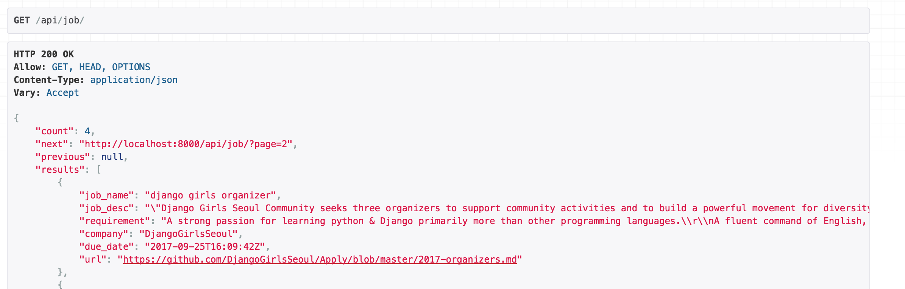

# Pagination
Pagination은 결과 값의 크기가 너무 클 때, 그런데 그 전부가 항상 필요한 건 아닐 때 자주 사용되는 기법입니다.

[Django 공식 문서](https://docs.djangoproject.com/en/1.11/topics/pagination/)에 따르면,
Django는 기본적으로 data를 page로 나눠서 관리할 수 있는 class를 몇가지 제공합니다. Page 간 이동(Previous/Next를 사용)까지 되는 버전으로요.

또한 rest_framework에서도 커스텀된 paging 방법을 제공하죠.
큰 결과 값들을 어떻게 쪼갤지에 대해서 custom 할 수 있습니다.

Pagination API는 다음 두가지 방식을 지원합니다.
* Pagination link가 response 값의 content안에 제공되는 방식 (built-in된 방식)
* Pagination link가 response 값의 header안에 포함되는 방식

Pagination은 일반 APIView가 아닌 GenericAPIView나 viewset을 사용해야만 자동으로 사용할 수 있습니다.
APIView를 사용한다면 따로 Pagination API를 호출해야합니다.

## Pagination 스타일 설정하기

기본적으로 Pagination은 크게 두 가지 속성을 기억하면 됩니다.

`DEFAULT_PAGINATION_CLASS`와 `PAGE_SIZE`.

만약 내장된 pagination을 사용하고 싶다면 settings.py에 다음과 같이 설정하면 됩니다.
```python
# settings.py
REST_FRAMEWORK = {
    'DEFAULT_PAGINATION_CLASS': 'rest_framework.pagination.LimitOffsetPagination',
    'PAGE_SIZE': 100
}
```

그러면 위에서 말한대로, response content안에 값들이 생기게 됩니다.

count는 총 데이터의 갯수, next는 다음 page의 url, previous는 이전 page의 url에 해당합니다.

settings.py에 설정한 건 default 값입니다. 하지만 view마다 따로 pagination class 값를 설정해 줄 수도 있습니다.

대개 앱 전체에 같은 pagination을 쓰게 되지만, page-size를 다르게 하고 싶은 경우 등이 생기면 다르게 할 수도 있겠죠.

## Pagination style 변경하기

Pagination의 특정 부분을 고치고 싶다면, `PageNumberPagination`를 상속받아 오버라이드 하면 됩니다.
```python
from rest_framework.pagination import PageNumberPagination

class JunePagination(PageNumberPagination):
    page_size = 2
    page_size_query_param = 'page_size'
    max_page_size = 1000
```
JunePagination은 page_size가 2인 pagination 입니다.

Custom Pagination을 적용해주려면,아래와 같이 pagination_class를 custom pagination으로 설정해주면됩니다.

```python
# views.py

class job_api(generics.ListAPIView):
    serializer_class = JobSerializer
    queryset = Job.objects.all()
    filter_backends = (filters.SearchFilter,django_filters.rest_framework.DjangoFilterBackend,filters.OrderingFilter,)
    search_fields = ('job_name', 'company')
    filter_fields = ('job_name', 'company')
    ordering_fields = ('job_name','company')
    ordering = ('job_name')
    pagination_class = JunePagination

```

적용한 모습을 볼까요?


## API 레퍼런스
### PageNumberPagination
PageNumberPagination은 custom시 예제로 든 Pagination 방식입니다.
request할 때 query로 page의 번호만 받는 방식이죠.

요청방식은 다음과 같습니다.
```
GET https://api.example.org/accounts/?page=4
```

응답방식은 다음과 같습니다.
```
HTTP 200 OK
{
    "count": 1023
    "next": "https://api.example.org/accounts/?page=5",
    "previous": "https://api.example.org/accounts/?page=3",
    "results": [
       …
    ]
}
```

GenericAPIView에서는 기본적으로 PageNumberPagination이 적용이 되어있습니다.

다음과 같은 정보들을 커스텀하고 싶다면, PageNumberPagination를 상속해서 위에서 말한 것 처럼 적용하면 됩니다.

```
django_paginator_class
# 사용할 Django Pagination class. 기본은 django.core.paginator.Paginator 이고, 대부분의 용례에서 괜찮은 방식입니다.

page_size
# page 크기를 나타내는 숫자 값. 이 부분을 설정하면, settings.py에서 정해진 PAGE_SIZE setting을 override하게 됩니다.

page_query_param
# pagination 관리에 쓰이는 query parameter의 이름을 나타내는 string 값.

page_size_query_param
# page_size query를 쓸 수 있으면 request 당 불러올 page 사이즈를 client가 설정할 수 있게 됩니다. 이 때 필요한 query parameter의 이름을 나타내는 string 값입니다.

max_page_size
# 최대 요청가능한 page size값입니다. page_size_query_param 가 설정되어야만 쓸 수 있습니다.

last_page_strings
# page_query_param와 함께 마지막 page를 요청할 때 쓰일 수 있는 string 값. 기본값은 ('last',)

template
# browsable API 로 만들 때 쓰이는 pagination control template의 이름. 기본값은 "rest_framework/pagination/numbers.html".

```

### LimitOffsetPagination
## CursorPagination
## Custom pagination styles
## Example
## Using your custom pagination class
## Pagination & schemas
## HTML pagination controls
## Customizing the controls
## Third party packages
## DRF-extensions
## drf-proxy-pagination
## link-header-pagination
