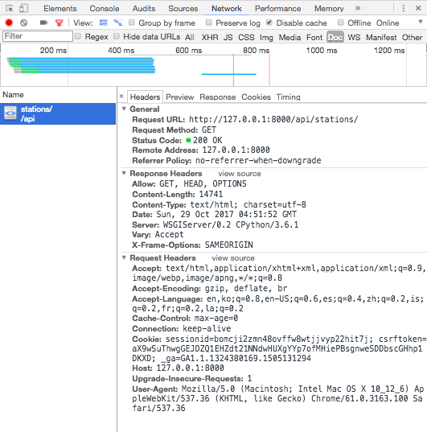

## 1. What is Parser?



- request header에 담긴 내용(미디어 타입 등)을 parse하여 요청한 대로 response를 보내준다.
- Accept, Content-type 등이 담겨 있다.
    - Accept: default는 `rest_framework.parsers.JSONParser`이기 때문에 `application/json`이 찍혀있음.
    - Content-type: text/html, application/json 등이 있음
- 사용 : 디폴트 렌더러는 `settings.py` REST_FRAMEWORK에 'DEFAULT_PARSER_CLASSES'로 넣어주고, `views.py`에서 특정 view에만 지정할 수도 있다.

    1. 디폴트

    ```python
    REST_FRAMEWORK = {
        'DEFAULT_PARSER_CLASSES': (
            'rest_framework.parsers.JSONParser',
        )
    }
    ```

    2. 특정 뷰

    ```python
    from rest_framework.parsers import JSONParser

    class ExampleView(APIView):
        parser_classes = (JSONParser,)

        def post(self, request, format=None):
            return Response({'received data': request.data})
    ```

---

## 2. DRF에서 제공하는 Parser 종류

1. JSONParser : Default
2. FormParser : html 폼 content
    - request.data will be populated with a QueryDict.
    - html 폼데이터를 완벽히 지원하려면 FormParser와 MultiPartParser를 같이 써야 함.
    - .media_type: `application/x-www-form-urlencoded` 로 지정해준다.
    * [Github 소스코드](https://github.com/encode/django-rest-framework/blob/ea894cd90a7544b0507c5f94bb3eb3da25000ccf/rest_framework/parsers.py)
3. MultiPartParser
    - request.data will be populated with a QueryDict.
    - .media_type: `multipart/form-data` 와 같이 생겼다.
4. FileUploadParser

---

## 3. Custom parsers도 만들 수 있다!
`.parse(self, stream, media_type, parser_context)` 오버라이딩 하기. 소스코드는 비어있음.

- stream : request 바디의 내용
- media_type : Optional
    - `*/*`, `text/plain`, `application/json`, `application/x-www-form-urlencoded`, `multipart/form-data`
- parser_context : 기타 정보를 dictionary 형태로 전달.
    - filename 등

```python
class PlainTextParser(BaseParser):

media_type = 'text/plain'

def parse(self, stream, media_type=None, parser_context=None):
    return stream.read()
```
